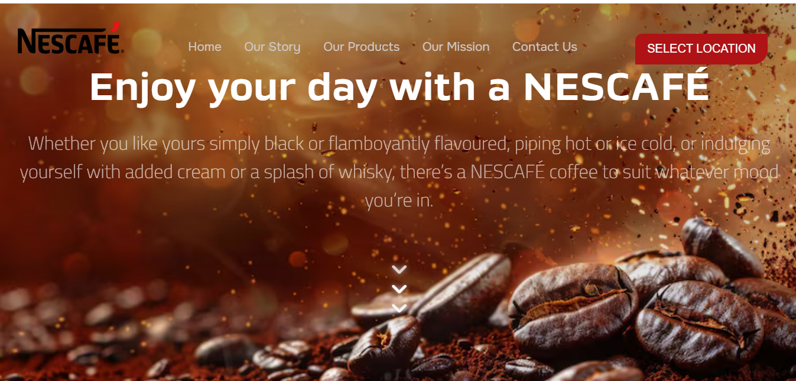

# ☕ Nescafé Landing Page Clone

<p align="center">
  
  
  
  
</p>

<p align="center">
  <a href="https://hafizengineermuhammadabdullah.github.io/MyNescafeProject/" target="_blank">
    
  </a>
</p>

> A modern and responsive **Nescafé-inspired landing page** built using HTML, CSS & JavaScript.
> Focused on real-world UI design, multi-section layout structuring, and responsive web development.

---

## 📸 Preview



---

## 🚀 Features

- 🎯 Clean, modern brand-accurate landing page design
- 📱 Fully responsive layout (separate `responsive.css` for clean separation)
- 🎨 Custom typography using **Titillium Web**, **Poppins** & **Montserrat**
- 🧭 Navbar with links and CTA button
- 🖼️ Multiple sections:
  - **Hero** — Bold hero with brand tagline
  - **Our Story** — Brand history & background
  - **Recipes** — Coffee recipe showcase
  - **Products** — Nescafé Gold & Classic highlight
  - **Mission** — Sustainability goals
  - **Contact** — Footer with social media links
- ✨ Smooth UI with gradients, overlays, and hover animations
- 🔗 Social icons via Font Awesome

---

## 🛠️ Technologies Used

| Technology | Purpose |
|---|---|
| HTML5 | Page structure & semantics |
| CSS3 | Styling, layout & animations |
| JavaScript | Interactivity (menu toggle etc.) |
| Google Fonts | Typography (Poppins, Montserrat, Titillium Web) |
| Font Awesome | Social media & UI icons |
| GitHub Pages | Free deployment & hosting |

---

## 📂 Project Structure

```bash
MyNescafeProject/
├── index.html        # Main HTML file
├── style.css         # Core styles
├── responsive.css    # Media queries & mobile layout
├── main.js           # JavaScript interactions
└── assets/
    ├── images/       # Section background & content images
    ├── logos/        # Nescafé logo assets
    └── icons/        # Custom icons
```

---

## ▶️ How to Run Locally

1. Clone the repository:
   ```bash
   git clone https://github.com/HafizEngineerMuhammadAbdullah/MyNescafeProject
   ```

2. Navigate into the project:
   ```bash
   cd MyNescafeProject
   ```

3. Open `index.html` in your browser — no build step needed!

Or just visit the **[Live Demo](https://hafizengineermuhammadabdullah.github.io/MyNescafeProject/)** directly.

---

## 💡 What I Learned

- Structuring large, multi-section HTML layouts
- Pairing and using multiple Google Fonts effectively
- Building responsive designs with separate CSS files
- Working with background images, overlays & gradients
- Matching a real brand's UI identity through code
- Deploying a static site using GitHub Pages

---

## 🔧 Planned Improvements

- [ ] JavaScript-powered mobile menu toggle
- [ ] Scroll animations using AOS or GSAP
- [ ] Optimized images for faster load time
- [ ] Improved accessibility (ARIA labels, alt text)

---

## ⚠️ Disclaimer

This project is built for **educational and learning purposes only**.
All brand names, trademarks, and assets belong to **Nestlé** and **Nescafé®**.

---

## 👨‍💻 Author

**Muhammad Abdullah**
CS Student @ UBIT · Frontend Developer · DSA in C++

[](https://www.linkedin.com/in/muhammad-abdullah-360a87384)
[](https://github.com/HafizEngineerMuhammadAbdullah)

---

⭐ If you found this project helpful, consider giving it a star!
